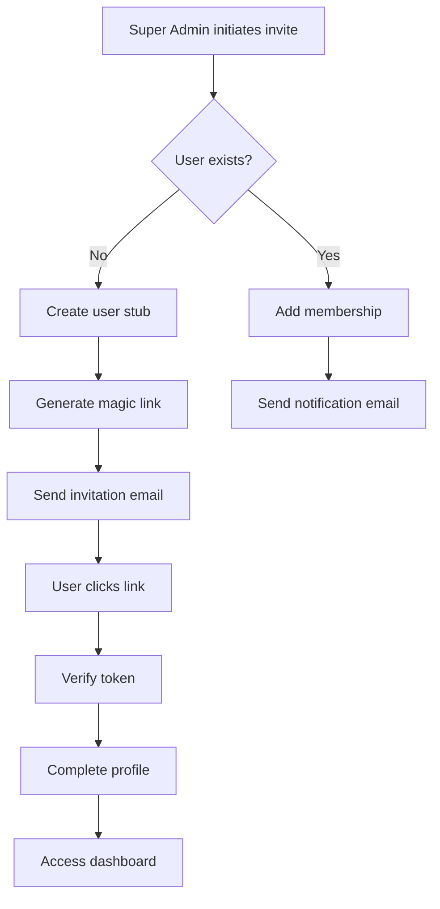

# Admin Invitation Flow Documentation

## Overview

The admin invitation flow allows Super Administrators to invite and assign church administrators (Pastors and Admins) to local churches. This system handles both existing and new users seamlessly.

## Process Flow



## Implementation Details

### 1. Invitation Initiation

Super Admin accesses: `/super/local-churches/[id]/admins`

Form fields:
- Email (required)
- Name (optional)
- Role (PASTOR or ADMIN)

### 2. User Creation Logic

#### Existing User
```typescript
if (userExists) {
  // Add/update membership
  await db.membership.upsert({
    where: { userId_localChurchId: {...} },
    create: { userId, localChurchId, role },
    update: { role }
  })
  
  // Send notification
  await sendRoleGrantEmail(user.email, role, localChurch)
}
```

#### New User
```typescript
if (!userExists) {
  // Create user stub
  const user = await db.user.create({
    data: {
      email,
      name,
      role,
      tenantId: church.id
    }
  })
  
  // Create verification token
  const token = generateToken()
  await db.verificationToken.create({
    data: { identifier: email, token, expires }
  })
  
  // Send invitation
  await sendInvitationEmail(email, token, role, localChurch)
}
```

### 3. Email Templates

#### Invitation Email (New User)
```html
Subject: Invitation to join [LocalChurch] as [Role]

You have been invited to join [LocalChurch] as a church [role].

Click the link below to accept the invitation and set up your account:
[Accept Invitation Button -> Magic Link URL]

This invitation link will expire in 24 hours.
```

#### Notification Email (Existing User)
```html
Subject: New role assigned at [LocalChurch]

You have been granted [Role] access to [LocalChurch].

You can now access administrative features when you sign in.
[Sign In Button]
```

### 4. Token Verification

Magic link format:
```
/auth/verify-request?token=TOKEN&email=EMAIL
```

Verification process:
1. Validate token exists and not expired
2. Match token with email
3. Mark email as verified
4. Delete used token
5. Create session
6. Redirect to dashboard

### 5. Membership Management

#### Adding Admin
```typescript
export async function inviteAdmin(localChurchId: string, data: InviteData) {
  // Validation
  const validated = inviteAdminSchema.parse(data)
  
  // Permission check
  await requireRole(UserRole.SUPER_ADMIN)
  
  // Process invitation
  const user = await findOrCreateUser(validated.email)
  await createMembership(user.id, localChurchId, validated.role)
  await sendAppropriateEmail(user, localChurch, validated.role)
  
  // Audit log
  await logAdminGrant(actor, user, localChurch, validated.role)
}
```

#### Removing Admin
```typescript
export async function removeAdmin(membershipId: string) {
  // Permission check
  await requireRole(UserRole.SUPER_ADMIN)
  
  // Delete membership
  const membership = await db.membership.delete({
    where: { id: membershipId }
  })
  
  // Audit log
  await logAdminRevoke(actor, membership)
}
```

## Security Considerations

### Token Security
- Tokens are cryptographically random (32 bytes)
- Tokens expire after 24 hours
- Tokens are single-use
- Tokens are deleted after use

### Permission Checks
- Only SUPER_ADMIN can invite admins
- Role assignment limited to PASTOR and ADMIN
- Cannot assign SUPER_ADMIN role via invitation

### Email Validation
- Email format validated with Zod
- Duplicate invitations are idempotent
- Failed email sends are logged

## Database Schema

### Relevant Tables

```prisma
model User {
  id            String
  email         String @unique
  name          String?
  role          UserRole
  tenantId      String?
  emailVerified DateTime?
  memberships   Membership[]
}

model Membership {
  id            String
  userId        String
  localChurchId String
  role          UserRole
  
  @@unique([userId, localChurchId])
}

model VerificationToken {
  identifier String
  token      String @unique
  expires    DateTime
  
  @@unique([identifier, token])
}
```

## Audit Trail

All admin invitations are logged:

```typescript
await db.auditLog.create({
  data: {
    actorId: superAdmin.id,
    action: 'GRANT_ROLE',
    entity: 'Membership',
    entityId: user.id,
    localChurchId: localChurch.id,
    meta: {
      email: user.email,
      role: grantedRole,
      invitationSent: true
    }
  }
})
```

## Error Handling

| Scenario | Error Response | User Action |
|----------|---------------|-------------|
| Invalid email | VALIDATION_ERROR | Correct email format |
| Church not found | NOT_FOUND | Verify church exists |
| Insufficient permissions | FORBIDDEN | Contact Super Admin |
| Email service failure | SERVER_ERROR | Retry invitation |
| Expired token | EXPIRED_TOKEN | Request new invitation |

## UI Components

### Admin List View
- Display current admins with roles
- Show invitation pending status
- Remove admin button (with confirmation)

### Invitation Form
- Email input with validation
- Role selector (PASTOR/ADMIN)
- Optional name field
- Send invitation button

### Success States
- "Invitation sent successfully"
- "Admin added to church"
- "Role updated successfully"

## Testing

### Unit Tests
```typescript
describe('Admin Invitation', () => {
  it('should create user stub for new email')
  it('should add membership for existing user')
  it('should send appropriate email type')
  it('should prevent non-super-admin access')
  it('should handle duplicate invitations')
})
```

### E2E Tests
```typescript
test('Complete invitation flow', async ({ page }) => {
  // Super admin invites new admin
  await inviteAdmin('admin@new.com', 'ADMIN')
  
  // Recipient clicks magic link
  await page.goto(magicLinkUrl)
  
  // Verify redirected to dashboard
  await expect(page).toHaveURL('/dashboard')
  
  // Verify has admin access
  await page.goto('/admin/members')
  await expect(page.getByRole('heading')).toBeVisible()
})
```

## Best Practices

1. **Always validate email format** before creating users
2. **Use database transactions** for user + membership creation
3. **Log all role assignments** for audit purposes
4. **Set appropriate token expiry** (24 hours recommended)
5. **Provide clear email templates** with church branding
6. **Handle edge cases gracefully** (expired tokens, duplicate invites)
7. **Test email delivery** in staging environment

## Future Enhancements

- Bulk invitation upload (CSV)
- Invitation tracking dashboard
- Customizable email templates per church
- Role-specific onboarding flows
- Automatic role expiration
- Delegate invitation ability to PASTOR role