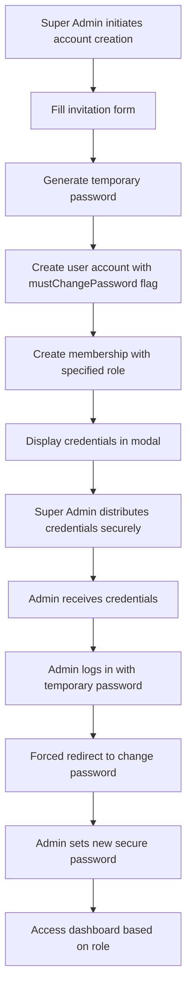

# Admin Account Creation System Documentation

## Overview

**IMPORTANT:** This document describes the UPDATED admin invitation system that uses password generation instead of email invitations. For complete details, see [Admin Invitation Workflow](./admin-invitation-workflow.md).

The admin invitation system allows Super Administrators to create and assign church administrators (Pastors and Admins) to local churches. The system generates temporary passwords that must be changed on first login, providing better security control and immediate access.

## Updated Process Flow



## Implementation Details

### 1. Admin Account Creation

Super Admin accesses: `/super/local-churches/[id]/admins`

Form fields:
- Email (required)
- Name (optional)
- Role (PASTOR or ADMIN)

**New Workflow**: Instead of sending emails, the system generates temporary passwords and displays them in a secure modal for manual distribution.

### 2. Updated User Creation Logic

#### New System (Password Generation)
```typescript
export async function inviteAdmin(localChurchId: string, formData: FormData): Promise<{
  success: boolean
  credentials?: { email: string; password: string }
  error?: string
}> {
  // Generate secure temporary password
  const temporaryPassword = generateTemporaryPassword() // e.g., "Swift-Mountain-847"
  const passwordHash = await bcrypt.hash(temporaryPassword, 12)
  
  // Create user account
  const user = await db.user.create({
    data: {
      email,
      name,
      role,
      tenantId: church.id,
      passwordHash,
      mustChangePassword: true // Force password change on first login
    }
  })
  
  // Create membership
  await db.membership.create({
    data: {
      userId: user.id,
      localChurchId,
      role
    }
  })
  
  // Return credentials for secure display
  return {
    success: true,
    credentials: {
      email: user.email,
      password: temporaryPassword
    }
  }
}
```

### 3. Password Generation System

#### Temporary Password Format
```typescript
// Generates readable passwords like: "Swift-Mountain-847"
export function generateTemporaryPassword(): string {
  const adjectives = ['Swift', 'Bright', 'Clear', 'Strong', ...]
  const nouns = ['River', 'Mountain', 'Eagle', 'Lion', ...]
  const adjective = adjectives[Math.floor(Math.random() * adjectives.length)]
  const noun = nouns[Math.floor(Math.random() * nouns.length)]
  const number = Math.floor(Math.random() * 900) + 100
  return `${adjective}-${noun}-${number}`
}
```

#### Credentials Display
The system shows generated credentials in a secure modal with:
- Email address
- Temporary password
- Copy functionality for both individual fields and combined credentials
- Security warning about password change requirement
- One-time display (credentials not shown again)

### 4. First Login Process

#### Forced Password Change Flow
1. Admin receives credentials from Super Admin
2. Admin logs in at `/auth/signin` with temporary password
3. Middleware detects `mustChangePassword: true` flag
4. Automatic redirect to `/auth/change-password`
5. Admin cannot access any other routes until password is changed
6. After password change, `mustChangePassword` is set to `false`
7. Role-based redirect to appropriate dashboard:
   - SUPER_ADMIN → `/super`
   - ADMIN/PASTOR → `/admin`
   - VIP → `/vip`
   - Others → `/dashboard`

### 5. Updated Membership Management

#### Creating Admin Account
```typescript
export async function inviteAdmin(localChurchId: string, formData: FormData) {
  // Validation
  const validated = inviteAdminSchema.parse({
    email: formData.get('email'),
    name: formData.get('name'),
    role: formData.get('role')
  })
  
  // Permission check
  await requireRole(UserRole.SUPER_ADMIN)
  
  // Check for existing user
  const existingUser = await db.user.findUnique({
    where: { email: validated.email }
  })
  if (existingUser) {
    return { success: false, error: "User with this email already exists" }
  }
  
  // Generate temporary password and create account
  const temporaryPassword = generateTemporaryPassword()
  const passwordHash = await bcrypt.hash(temporaryPassword, 12)
  
  // Create user and membership
  const user = await db.user.create({
    data: {
      email: validated.email,
      name: validated.name,
      role: validated.role,
      tenantId: localChurch.church.id,
      passwordHash,
      mustChangePassword: true
    }
  })
  
  await db.membership.create({
    data: {
      userId: user.id,
      localChurchId,
      role: validated.role
    }
  })
  
  // Audit log
  await logAdminGrant(currentUser.id, user, localChurch, validated.role)
  
  return {
    success: true,
    credentials: {
      email: user.email,
      password: temporaryPassword
    }
  }
}
```

#### Removing Admin
```typescript
export async function removeAdmin(membershipId: string) {
  // Permission check
  await requireRole(UserRole.SUPER_ADMIN)
  
  // Delete membership
  const membership = await db.membership.delete({
    where: { id: membershipId }
  })
  
  // Audit log
  await logAdminRevoke(actor, membership)
}
```

## Security Considerations

### Password Security
- Temporary passwords are cryptographically secure but human-readable
- Passwords are hashed with bcrypt (strength: 12)
- `mustChangePassword` flag forces immediate password change
- Users cannot access system until password is changed

### Permission Checks
- Only SUPER_ADMIN can create admin accounts
- Role assignment limited to PASTOR and ADMIN
- Cannot assign SUPER_ADMIN role via this system

### Access Control
- Middleware enforces password change before system access
- Credentials are displayed only once in secure modal
- No email dependency eliminates delivery vulnerabilities
- Direct credential distribution provides better control

## Database Schema

### Relevant Tables

```prisma
model User {
  id                String
  email             String @unique
  name              String?
  role              UserRole
  tenantId          String?
  passwordHash      String?
  mustChangePassword Boolean @default(true)
  emailVerified     DateTime?
  memberships       Membership[]
}

model Membership {
  id            String
  userId        String
  localChurchId String
  role          UserRole
  
  @@unique([userId, localChurchId])
}

// VerificationToken table no longer used for admin invitations
// but maintained for other authentication flows
```

## Audit Trail

All admin account creations are logged:

```typescript
await db.auditLog.create({
  data: {
    actorId: superAdmin.id,
    action: 'CREATE_ADMIN_ACCOUNT',
    entity: 'User',
    entityId: user.id,
    localChurchId: localChurch.id,
    meta: {
      email: user.email,
      role: grantedRole,
      passwordGenerated: true,
      mustChangePassword: true
    }
  }
})
```

## Error Handling

| Scenario | Error Response | User Action |
|----------|---------------|-------------|
| Invalid email | VALIDATION_ERROR | Correct email format |
| Church not found | NOT_FOUND | Verify church exists |
| Insufficient permissions | FORBIDDEN | Contact Super Admin |
| Email already exists | DUPLICATE_ENTRY | Check existing accounts |
| Password generation failure | SERVER_ERROR | Retry account creation |

## UI Components

### Admin List View
- Display current admins with roles
- Show account status (active, password change required)
- Remove admin button (with confirmation)

### Account Creation Form
- Email input with validation
- Role selector (PASTOR/ADMIN)
- Optional name field
- Create Admin Account button

### Success States
- "Admin account created successfully"
- Credentials display modal with copy functionality
- "Admin added to church"

## Testing

### Unit Tests
```typescript
describe('Admin Account Creation', () => {
  it('should generate secure temporary password')
  it('should create user with mustChangePassword flag')
  it('should create membership for new admin')
  it('should prevent non-super-admin access')
  it('should prevent duplicate email creation')
  it('should return credentials for display')
})
```

### E2E Tests
```typescript
test('Complete admin creation and first login flow', async ({ page }) => {
  // Super admin creates new admin account
  const credentials = await createAdminAccount('admin@new.com', 'ADMIN')
  
  // New admin logs in with temporary password
  await page.goto('/auth/signin')
  await page.fill('#email', credentials.email)
  await page.fill('#password', credentials.password)
  await page.click('button[type="submit"]')
  
  // Verify forced redirect to change password
  await expect(page).toHaveURL('/auth/change-password')
  
  // Admin changes password
  await page.fill('#newPassword', 'NewSecurePassword123!')
  await page.fill('#confirmPassword', 'NewSecurePassword123!')
  await page.click('button[type="submit"]')
  
  // Verify redirected to admin dashboard
  await expect(page).toHaveURL('/admin')
  
  // Verify has admin access
  await page.goto('/admin/members')
  await expect(page.getByRole('heading')).toBeVisible()
})
```

## Best Practices

1. **Always validate email format** before creating users
2. **Use database transactions** for user + membership creation
3. **Log all role assignments** for audit purposes
4. **Distribute credentials securely** through encrypted channels
5. **Emphasize temporary password nature** to recipients
6. **Handle edge cases gracefully** (duplicate emails, generation failures)
7. **Test password generation variety** to ensure randomness
8. **Verify forced password change flow** in all environments

## Future Enhancements

- Bulk admin account creation (CSV upload)
- Admin account management dashboard
- Configurable password complexity requirements
- Role-specific onboarding flows after password change
- Automatic role expiration
- Delegate account creation ability to PASTOR role
- Integration with secure messaging systems for credential distribution
- Password strength analysis and recommendations

## Migration from Email-Based System

This system replaces the previous email-based invitation system. Key benefits:

- **Eliminated Dependencies**: No reliance on email delivery or DNS
- **Improved Security**: Direct password control and forced changes
- **Better User Experience**: Immediate access with simple login flow
- **Enhanced Audit Trail**: Complete visibility into account creation
- **Reduced Support Issues**: No email delivery problems or expired tokens

For complete implementation details, see [Admin Invitation Workflow](./admin-invitation-workflow.md).