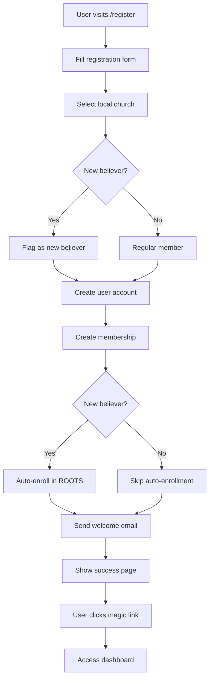

# Member Registration Documentation

## Overview

The member registration flow provides a public self-service interface for new members to join a local church. The system handles member creation, church assignment, and automatic enrollment in discipleship pathways for new believers.

## Registration Flow



## Implementation

### 1. Registration Page

**Route**: `/register` (public)

**Form Fields**:
- Email (required, validated)
- Full Name (required)
- Local Church (required, dropdown)
- New Believer checkbox (optional)

```typescript
interface RegistrationData {
  email: string
  name: string
  localChurchId: string
  isNewBeliever: boolean
}
```

### 2. Validation

Using Zod schema:

```typescript
const registerSchema = z.object({
  email: z.string().email('Invalid email address'),
  name: z.string().min(1, 'Name is required'),
  localChurchId: z.string().min(1, 'Please select a church'),
  isNewBeliever: z.boolean().default(false),
})
```

### 3. User Creation Process

```typescript
export async function registerMember(data: RegistrationData) {
  // 1. Validate input
  const validated = registerSchema.parse(data)
  
  // 2. Check for existing user
  if (await userExists(validated.email)) {
    redirect('/register?error=email_exists')
  }
  
  // 3. Create user account
  const user = await db.user.create({
    data: {
      email: validated.email,
      name: validated.name,
      role: UserRole.MEMBER,
      tenantId: localChurch.church.id,
      isNewBeliever: validated.isNewBeliever
    }
  })
  
  // 4. Create membership
  await db.membership.create({
    data: {
      userId: user.id,
      localChurchId: validated.localChurchId,
      role: UserRole.MEMBER,
      isNewBeliever: validated.isNewBeliever
    }
  })
  
  // 5. Handle new believer enrollment
  if (validated.isNewBeliever) {
    await enrollInRootsPathway(user.id, localChurch.church.id)
  }
  
  // 6. Send welcome email with magic link
  await sendWelcomeEmail(user)
  
  // 7. Redirect to success page
  redirect('/register/success')
}
```

### 4. New Believer Auto-Enrollment

```typescript
async function enrollInRootsPathway(userId: string, churchId: string) {
  const rootsPathway = await db.pathway.findFirst({
    where: {
      tenantId: churchId,
      type: PathwayType.ROOTS
    }
  })
  
  if (rootsPathway) {
    await db.pathwayEnrollment.create({
      data: {
        pathwayId: rootsPathway.id,
        userId: userId,
        status: EnrollmentStatus.ENROLLED
      }
    })
  }
}
```

### 5. Email Communication

#### Welcome Email Template

```html
Subject: Welcome to [LocalChurch]!

Hi [Name],

Your registration has been successful. Click the link below to sign in:
[Sign In Button -> Magic Link]

<!-- If new believer -->
Welcome to the family of God!
As a new believer, you've been automatically enrolled in our ROOTS pathway.
<!-- End if -->

This sign-in link expires in 24 hours.
```

### 6. Success Page

Shows:
- Confirmation message
- Email sent notification
- Sign in link
- Instructions for email not received

## Security Measures

### Email Verification
- Magic link sent to email
- Token expires in 24 hours
- Single-use token
- Email marked as verified on first sign-in

### Duplicate Prevention
```typescript
const existingUser = await db.user.findUnique({
  where: { email }
})
if (existingUser) {
  redirect('/register?error=email_exists')
}
```

### Rate Limiting
- Maximum 3 registration attempts per email per hour
- IP-based rate limiting for spam prevention

### Input Sanitization
- All inputs validated with Zod
- SQL injection prevented via Prisma
- XSS protection built into React

## Error Handling

| Error Code | Description | User Message |
|------------|-------------|--------------|
| `email_exists` | Email already registered | "An account with this email already exists" |
| `invalid_data` | Validation failed | "Please check your information and try again" |
| `invalid_church` | Church not found | "Please select a valid church" |
| `server_error` | Registration failed | "Registration failed. Please try again" |

### Error Display
```typescript
// On registration page
const searchParams = useSearchParams()
const error = searchParams.get('error')

{error === 'email_exists' && (
  <Alert variant="destructive">
    An account with this email already exists.
    <Link href="/auth/signin">Sign in instead</Link>
  </Alert>
)}
```

## Database Operations

### Tables Affected

1. **User** - New user record
2. **Membership** - Church membership
3. **PathwayEnrollment** - If new believer
4. **VerificationToken** - For magic link
5. **AuditLog** - Registration event

### Transaction Safety

```typescript
await db.$transaction(async (tx) => {
  const user = await tx.user.create({...})
  await tx.membership.create({...})
  if (isNewBeliever) {
    await tx.pathwayEnrollment.create({...})
  }
  await tx.verificationToken.create({...})
})
```

## Church Selection

### Local Church Dropdown

Churches displayed as: "Parent Church - Local Church Name"

```typescript
const localChurches = await db.localChurch.findMany({
  include: { church: true },
  orderBy: [
    { church: { name: 'asc' } },
    { name: 'asc' }
  ]
})

// Display: "HPCI - Manila"
```

### Invitation Links (Future Enhancement)

Pre-select church via URL parameter:
```
/register?church=local_manila&token=abc123
```

## Testing

### Unit Tests

```typescript
describe('Member Registration', () => {
  it('should create user with member role')
  it('should create membership for selected church')
  it('should auto-enroll new believers in ROOTS')
  it('should prevent duplicate email registration')
  it('should validate all required fields')
  it('should send welcome email with magic link')
})
```

### E2E Tests

```typescript
test('Complete registration flow', async ({ page }) => {
  await page.goto('/register')
  
  // Fill form
  await page.fill('[name="email"]', 'newmember@test.com')
  await page.fill('[name="name"]', 'John Doe')
  await page.selectOption('[name="localChurchId"]', 'local_manila')
  await page.check('[name="isNewBeliever"]')
  
  // Submit
  await page.click('button[type="submit"]')
  
  // Verify success page
  await expect(page).toHaveURL('/register/success')
  await expect(page.getByText('Registration Successful')).toBeVisible()
  
  // Verify database
  const user = await db.user.findUnique({
    where: { email: 'newmember@test.com' }
  })
  expect(user).toBeTruthy()
  expect(user.role).toBe('MEMBER')
  expect(user.isNewBeliever).toBe(true)
})
```

## Analytics & Metrics

Track:
- Registration completion rate
- Church distribution
- New believer percentage
- Drop-off points
- Email verification rate

```typescript
await db.auditLog.create({
  data: {
    actorId: user.id,
    action: 'MEMBER_REGISTRATION',
    entity: 'User',
    entityId: user.id,
    localChurchId: localChurchId,
    meta: {
      isNewBeliever,
      registrationSource: 'web',
      churchSelected: localChurchId
    }
  }
})
```

## Best Practices

1. **Keep form simple** - Only essential fields
2. **Clear church selection** - Show full church names
3. **Explain new believer option** - Help text for checkbox
4. **Immediate feedback** - Show success/error clearly
5. **Mobile-friendly** - Responsive form design
6. **Accessible** - Proper labels and ARIA attributes
7. **Follow-up** - Send welcome series emails

## Future Enhancements

1. **Social sign-up** - Google/Facebook OAuth
2. **Invitation codes** - Pre-approved registration
3. **Family registration** - Register multiple members
4. **Profile completion** - Progressive profiling
5. **Church finder** - Map-based church selection
6. **Referral tracking** - Track who invited whom
7. **Custom fields** - Church-specific questions
8. **SMS verification** - Alternative to email