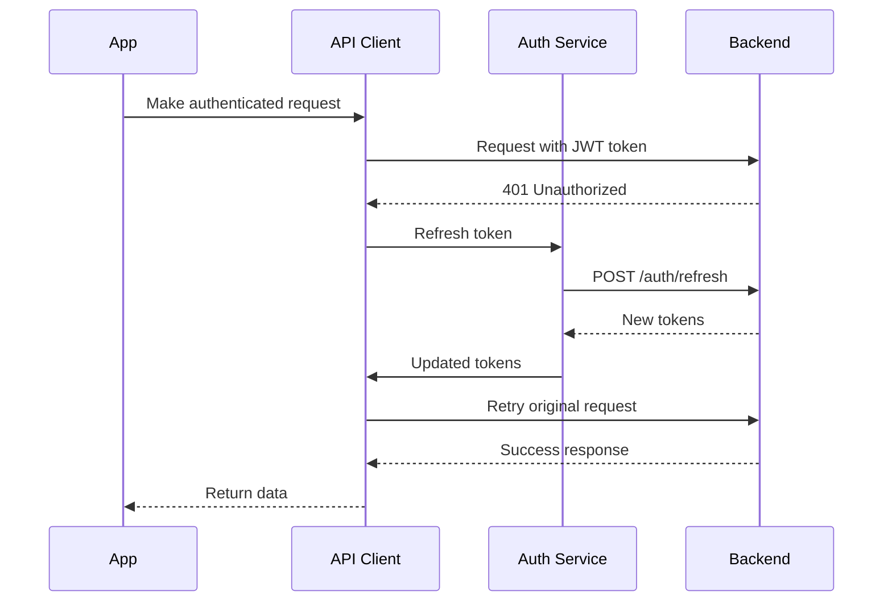

# Backend Integration Guide

This guide covers the integration of the Drouple Mobile app with the production backend API.

## Table of Contents

1. [Overview](#overview)
2. [API Architecture](#api-architecture)
3. [Authentication Flow](#authentication-flow)
4. [Service Integration](#service-integration)
5. [Mock vs Production Switch](#mock-vs-production-switch)
6. [Error Handling](#error-handling)
7. [Offline Support](#offline-support)
8. [Testing Backend Integration](#testing-backend-integration)

## Overview

The Drouple Mobile app is designed with a flexible architecture that supports both mock data (for development) and real backend API integration (for production). The switch between these modes is controlled by configuration flags.

### Key Features

- **Offline-first Architecture**: Requests are queued when offline and processed when connection is restored
- **Token Refresh**: Automatic JWT token refresh with fallback to logout
- **Caching**: Intelligent caching with configurable TTL
- **Error Handling**: Comprehensive error handling with user-friendly messages
- **Idempotency**: Mutation requests use idempotency keys to prevent duplicates

## API Architecture

### Client Structure

```
src/lib/api/
├── client.ts              # Main API client with authentication
├── index.ts               # Service exports and configuration
├── contracts.ts           # Type definitions
├── services/
│   ├── auth.ts           # Authentication service
│   ├── events.ts         # Events management service
│   ├── checkin.ts        # Service check-ins service
│   ├── groups.ts         # Life groups service
│   └── pathways.ts       # Discipleship pathways service
└── legacy/               # Legacy mock implementations
    ├── auth.ts
    └── auth.mock.ts
```

### API Client Features

```typescript
import { apiClient } from '@/lib/api';

// Automatic authentication
apiClient.setAuthToken(token);

// Request with retry and caching
const response = await apiClient.get('/events', {
  cache: true,
  cacheTTL: 5 * 60 * 1000, // 5 minutes
  retries: 3,
});

// Offline-capable mutations
const result = await apiClient.post('/events', eventData, {
  offline: true, // Queue if offline
  idempotencyKey: 'unique-key',
});
```

## Authentication Flow

### JWT Token Management

The authentication service handles:

1. **Login**: Exchange credentials for JWT tokens
2. **Token Refresh**: Automatic refresh before expiration
3. **Logout**: Token invalidation
4. **Session Management**: Persistent storage of tokens

```typescript
import { authService } from '@/lib/api';

// Login
const loginResult = await authService.login({
  email: 'user@example.com',
  password: 'password',
});

// Automatic token refresh happens transparently
const profileResult = await authService.getProfile();
```

### Token Refresh Flow



## Service Integration

### Events Service

```typescript
import { eventsService } from '@/lib/api';

// Get events list
const events = await eventsService.getEvents({
  page: 1,
  limit: 20,
  upcoming: true,
});

// RSVP to event
const rsvp = await eventsService.rsvpToEvent({
  eventId: 'event-123',
  notes: 'Looking forward to it!',
});

// Get user's RSVPs
const userRSVPs = await eventsService.getUserRSVPs(true);
```

### Check-in Service

```typescript
import { checkInService } from '@/lib/api';

// Get today's services
const services = await checkInService.getTodaysServices();

// Check in to service
const checkIn = await checkInService.checkIn({
  serviceId: 'service-123',
  location: 'Main Sanctuary',
});

// QR code check-in flow
const qrValidation = await checkInService.validateQRCode(qrToken);
if (qrValidation.success && qrValidation.data.canCheckIn) {
  const checkIn = await checkInService.checkInViaQR(qrToken);
}
```

### Life Groups Service

```typescript
import { groupsService } from '@/lib/api';

// Get available groups
const groups = await groupsService.getGroups({
  isOpen: true,
  available: true,
});

// Request to join group
const joinRequest = await groupsService.requestToJoin({
  groupId: 'group-123',
  message: 'I would like to join this group',
});

// Get user's groups
const userGroups = await groupsService.getUserGroups();
```

### Pathways Service

```typescript
import { pathwaysService } from '@/lib/api';

// Get available pathways
const pathways = await pathwaysService.getAvailablePathways();

// Enroll in pathway
const enrollment = await pathwaysService.enrollInPathway('pathway-123');

// Complete step
const stepCompletion = await pathwaysService.completeStep('pathway-123', {
  stepId: 'step-456',
  notes: 'Completed reading and reflection',
});

// Get progress summary
const progress = await pathwaysService.getProgressSummary();
```

## Mock vs Production Switch

### Configuration Flag

The app uses a single configuration flag to switch between mock and production APIs:

```typescript
// src/lib/api/index.ts
const USE_MOCK_APIS = true; // Set to false for production
```

### Environment-based Configuration

For automated switching based on environment:

```typescript
// src/config/env.ts
const USE_MOCK_APIS = isDevelopment() || !config.apiUrl;
```

### Service Implementation

Each service has both mock and production implementations:

```typescript
// Mock implementation (development)
const mockEventsService = {
  async getEvents() {
    return { success: true, data: MOCK_EVENTS };
  },
};

// Production implementation
const productionEventsService = {
  async getEvents(query) {
    return apiClient.get('/events', { params: query });
  },
};

// Export based on configuration
export const eventsService = USE_MOCK_APIS
  ? mockEventsService
  : productionEventsService;
```

## Error Handling

### API Error Types

```typescript
interface ApiError {
  message: string;
  status: number;
  code?: string;
  errors?: Record<string, string[]>;
}
```

### Error Handling Patterns

```typescript
// Service level error handling
try {
  const result = await eventsService.getEvents();
  if (!result.success) {
    throw new Error(result.error);
  }
  return result.data;
} catch (error) {
  // Handle specific error types
  if (error.status === 401) {
    // Handle authentication error
  } else if (error.status === 403) {
    // Handle authorization error
  } else if (error.code === 'NETWORK_ERROR') {
    // Handle network error
  }
}

// Component level error handling
const { data, error, isLoading } = useQuery({
  queryKey: ['events'],
  queryFn: eventsService.getEvents,
  onError: error => {
    if (error.code === 'OFFLINE') {
      showToast('You are offline. Changes will be synced when you reconnect.');
    } else {
      showToast(error.message || 'Something went wrong');
    }
  },
});
```

## Offline Support

### Offline Queue

The API client automatically queues mutations when offline:

```typescript
// Request is queued automatically when offline
const result = await apiClient.post('/events/rsvp', data, {
  offline: true,
});

// When connection is restored, queued requests are processed
```

### Offline Detection

```typescript
import { useNetInfo } from '@react-native-community/netinfo';

const { isConnected } = useNetInfo();

useEffect(() => {
  if (isConnected) {
    // Process offline queue
    apiClient.processOfflineQueue();
  }
}, [isConnected]);
```

### Cache Strategy

```typescript
// Cache configuration for different data types
const cacheConfig = {
  events: { ttl: 5 * 60 * 1000 }, // 5 minutes
  profile: { ttl: 30 * 60 * 1000 }, // 30 minutes
  services: { ttl: 60 * 1000 }, // 1 minute
};
```

## Testing Backend Integration

### API Testing

```typescript
// __tests__/api/events.test.ts
import { eventsService } from '@/lib/api';

describe('Events Service', () => {
  beforeEach(() => {
    // Mock API responses
    global.fetch = jest.fn();
  });

  test('should fetch events successfully', async () => {
    const mockResponse = {
      success: true,
      data: { events: [], pagination: {} },
    };

    (global.fetch as jest.Mock).mockResolvedValueOnce({
      ok: true,
      json: () => Promise.resolve(mockResponse),
    });

    const result = await eventsService.getEvents();

    expect(result.success).toBe(true);
    expect(result.data.events).toBeInstanceOf(Array);
  });

  test('should handle API errors gracefully', async () => {
    (global.fetch as jest.Mock).mockResolvedValueOnce({
      ok: false,
      status: 500,
      json: () => Promise.resolve({ message: 'Server Error' }),
    });

    const result = await eventsService.getEvents();

    expect(result.success).toBe(false);
    expect(result.error).toBe('Server Error');
  });
});
```

### Integration Testing

```typescript
// __tests__/integration/auth-flow.test.ts
import { authService, apiClient } from '@/lib/api';

describe('Authentication Flow', () => {
  test('should authenticate and make authorized requests', async () => {
    // Login
    const loginResult = await authService.login({
      email: 'test@example.com',
      password: 'password',
    });

    expect(loginResult.success).toBe(true);
    expect(loginResult.data.accessToken).toBeTruthy();

    // Set token
    apiClient.setAuthToken(loginResult.data.accessToken);

    // Make authorized request
    const profileResult = await authService.getProfile();
    expect(profileResult.success).toBe(true);
  });
});
```

### Mock Server Setup

For development and testing, you can set up a mock server:

```javascript
// mock-server/index.js
const express = require('express');
const app = express();

app.use(express.json());

// Auth endpoints
app.post('/auth/login', (req, res) => {
  res.json({
    user: { id: '1', email: req.body.email },
    accessToken: 'mock-jwt-token',
    refreshToken: 'mock-refresh-token',
  });
});

// Events endpoints
app.get('/events', (req, res) => {
  res.json({
    events: [],
    pagination: { page: 1, limit: 20, total: 0 },
  });
});

app.listen(3001, () => {
  console.log('Mock server running on port 3001');
});
```

## Production Deployment

### Environment Configuration

```typescript
// src/config/env.ts
export const config = {
  apiUrl: process.env.EXPO_PUBLIC_API_URL || 'https://api.drouple.com',
  enableMockApis: process.env.EXPO_PUBLIC_ENABLE_MOCK_APIS === 'true',
  enableOfflineMode: true,
  enableAnalytics: !isDevelopment(),
};
```

### Deployment Checklist

Before deploying with backend integration:

- [ ] Set `USE_MOCK_APIS = false`
- [ ] Configure production API URL
- [ ] Set up proper error logging (Sentry)
- [ ] Test authentication flow
- [ ] Test offline functionality
- [ ] Verify all API endpoints
- [ ] Test token refresh mechanism
- [ ] Validate error handling
- [ ] Check network request timeouts
- [ ] Test with slow network conditions

### Monitoring

Set up monitoring for:

- API response times
- Error rates by endpoint
- Token refresh failures
- Offline queue processing
- Cache hit rates
- Network connectivity issues

---

_This backend integration guide is maintained by the Drouple development team. Last updated: January 2025_
